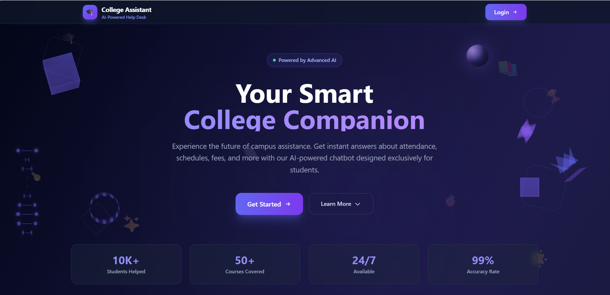
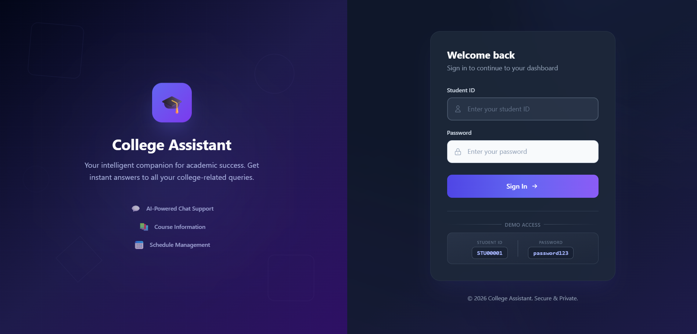
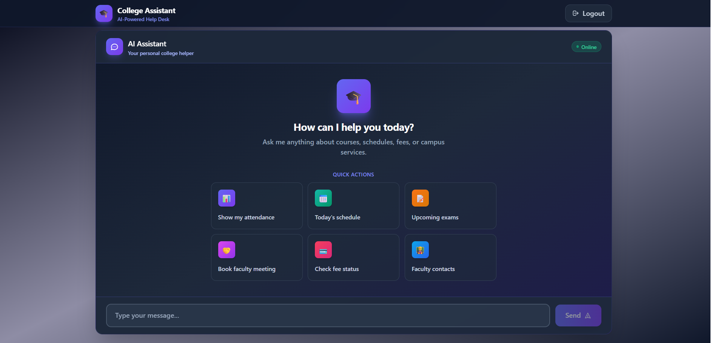
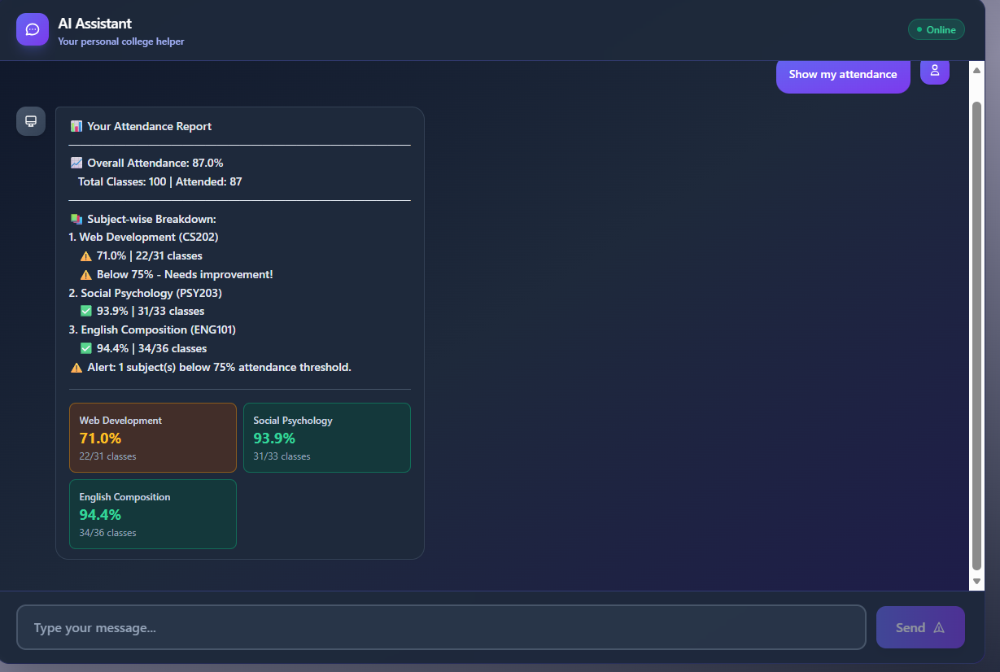

# 🎓 College Assistant - AI-Powered Chatbot

An intelligent, AI-powered college assistant chatbot that helps students with academic queries, attendance tracking, schedules, fee information, and more.


--- Projecct Deploy Link : https://ai-based-user-centric-chatbot-using-rag.onrender.com

## 📋 Table of Contents

- [Features](#-features)
- [Tech Stack](#-tech-stack)
- [Project Structure](#-project-structure)
- [Installation](#-installation)
- [Configuration](#-configuration)
- [Running the Application](#-running-the-application)
- [API Endpoints](#-api-endpoints)
- [Database Schema](#-database-schema)
- [Screenshots](#-screenshots)

---

## ✨ Features

### 🤖 AI-Powered Chat

- Natural language processing using **Groq LLM** (Llama 3.1 8B)
- Context-aware responses with RAG (Retrieval-Augmented Generation)
- Semantic search using **ChromaDB** vector store

### 📊 Attendance Tracking

- Real-time attendance monitoring
- Subject-wise breakdown with percentages
- Low attendance alerts (below 75%)
- Visual attendance cards

### 📅 Schedule Management

- Daily class schedules
- Exam timetables
- Academic calendar integration

### 💳 Fee Management

- Fee payment status
- Due date reminders
- Payment history

### 👨‍🏫 Faculty Connect

- Faculty contact information
- Appointment booking system

### 📚 Course Information

- Course details and syllabi
- Enrollment information

---

## 🛠 Tech Stack

### Backend

| Technology                | Purpose                 |
| ------------------------- | ----------------------- |
| **FastAPI**               | REST API framework      |
| **Python 3.10+**          | Backend language        |
| **SQLite**                | Relational database     |
| **ChromaDB**              | Vector database for RAG |
| **Groq SDK**              | LLM integration         |
| **Sentence Transformers** | Text embeddings         |

### Frontend

| Technology       | Purpose      |
| ---------------- | ------------ |
| **React 18**     | UI framework |
| **Vite 5**       | Build tool   |
| **Tailwind CSS** | Styling      |
| **React Router** | Navigation   |

---

## 📁 Project Structure

```
D:\ai\
├── api/                          # Backend API
│   ├── main.py                   # FastAPI application & endpoints
│   ├── auth.py                   # Authentication logic
│   ├── database.py               # Database connection
│   └── models.py                 # Pydantic models
│
├── data/                         # Data storage
│   ├── database/                 # SQLite database
│   │   ├── college.db            # Main database
│   │   ├── students.csv          # Student records
│   │   ├── courses.csv           # Course information
│   │   ├── attendance.csv        # Attendance records
│   │   ├── enrollments.csv       # Enrollments
│   │   ├── exams.csv             # Exam schedules
│   │   ├── faculty.csv           # Faculty info
│   │   ├── fees.csv              # Fee records
│   │   └── conversation_history.csv
│   │
│   ├── chroma/                   # Vector database
│   │   └── chroma.sqlite3        # ChromaDB storage
│   │
│   ├── calendar/                 # Academic calendar docs
│   ├── catalogs/                 # Course catalogs
│   ├── facilities/               # Facility information
│   ├── faculty/                  # Faculty documents
│   ├── fees_scholarships/        # Fee structure docs
│   ├── handbook/                 # Student handbook
│   └── indexed_documents.jsonl   # Document index
│
├── frontend-react/               # React frontend
│   ├── src/
│   │   ├── components/
│   │   │   ├── ChatInterface.jsx # Main chat UI
│   │   │   └── Layout.jsx        # App layout
│   │   │
│   │   ├── pages/
│   │   │   ├── PortfolioPage.jsx # Landing page (3D models)
│   │   │   ├── LoginPage.jsx     # Authentication
│   │   │   ├── ChatPage.jsx      # Chat wrapper
│   │   │   ├── DashboardPage.jsx # Dashboard
│   │   │   └── ...               # Other pages
│   │   │
│   │   ├── services/
│   │   │   └── api.js            # API service
│   │   │
│   │   ├── App.jsx               # Main app with routes
│   │   └── main.jsx              # Entry point
│   │
│   ├── package.json
│   ├── vite.config.js
│   └── tailwind.config.js
│
├── utils/
│   └── setup_vectordb.py         # Vector DB setup
│
├── .env                          # Environment variables
├── requirements.txt              # Python dependencies
└── README.md                     # This file
```

---

## 🚀 Installation

### Prerequisites

- Python 3.10 or higher
- Node.js 18 or higher
- npm or yarn

### 1. Clone the Repository

```bash
git clone <repository-url>
cd ai
```

### 2. Backend Setup

```bash
# Create virtual environment
python -m venv venv

# Activate virtual environment
# Windows:
venv\Scripts\activate
# Linux/Mac:
source venv/bin/activate

# Install dependencies
pip install -r requirements.txt
```

### 3. Frontend Setup

```bash
cd frontend-react
npm install
```

---

## ⚙️ Configuration

### Environment Variables (`.env`)

```env
# LLM Configuration
GROQ_API_KEY=your_groq_api_key_here
MODEL_NAME=groq-llama-3.1-8b-instant

# Vector Store
VECTOR_STORE=chroma
CHROMA_DIR=./data/chroma

# Optional: OpenAI (if using)
OPENAI_API_KEY=
EMBEDDING_MODEL=text-embedding-3-small

# Optional: Pinecone (if using)
PINECONE_API_KEY=
PINECONE_ENVIRONMENT=
PINECONE_INDEX=
```

### Getting a Groq API Key

1. Visit [console.groq.com](https://console.groq.com)
2. Create an account and generate an API key
3. Add it to your `.env` file

---

## ▶️ Running the Application

### Start Backend Server

```bash
# From project root (D:\ai)
uvicorn api.main:app --reload
```

Backend runs at: `http://127.0.0.1:8000`

### Start Frontend Server

```bash
# From frontend directory
cd frontend-react
npm run dev
```

Frontend runs at: `http://localhost:5173`

### Access the Application

1. Open `http://localhost:5173` in your browser
2. You'll see the Portfolio/Landing page
3. Click "Login" to access the chat interface

### Demo Credentials

- **Student ID:** `STU00001`
- **Password:** `password123`

---

## 📡 API Endpoints

### Authentication

| Method | Endpoint     | Description |
| ------ | ------------ | ----------- |
| POST   | `/api/login` | User login  |

### Chat

| Method | Endpoint    | Description        |
| ------ | ----------- | ------------------ |
| POST   | `/api/chat` | Send message to AI |

### Student Data

| Method | Endpoint                  | Description            |
| ------ | ------------------------- | ---------------------- |
| GET    | `/api/student/profile`    | Get student profile    |
| GET    | `/api/student/attendance` | Get attendance records |
| GET    | `/api/student/schedule`   | Get class schedule     |
| GET    | `/api/student/fees`       | Get fee status         |
| GET    | `/api/student/exams`      | Get exam schedule      |

### Faculty

| Method | Endpoint           | Description      |
| ------ | ------------------ | ---------------- |
| GET    | `/api/faculty`     | Get faculty list |
| POST   | `/api/appointment` | Book appointment |

---

## 🗄️ Database Schema

### Students Table

| Column     | Type    | Description                  |
| ---------- | ------- | ---------------------------- |
| student_id | TEXT    | Primary key (e.g., STU00001) |
| name       | TEXT    | Student name                 |
| email      | TEXT    | Email address                |
| password   | TEXT    | Hashed password              |
| department | TEXT    | Department name              |
| semester   | INTEGER | Current semester             |

### Attendance Table

| Column        | Type    | Description      |
| ------------- | ------- | ---------------- |
| id            | INTEGER | Primary key      |
| student_id    | TEXT    | Foreign key      |
| course_id     | TEXT    | Course ID        |
| attended      | INTEGER | Classes attended |
| total_classes | INTEGER | Total classes    |
| percentage    | REAL    | Attendance %     |

### Courses Table

| Column      | Type    | Description  |
| ----------- | ------- | ------------ |
| course_id   | TEXT    | Primary key  |
| course_name | TEXT    | Course name  |
| credits     | INTEGER | Credit hours |
| department  | TEXT    | Department   |

---

## 🎨 UI Theme

The application uses a **professional dark theme** with:

- **Primary Colors:** Indigo (#6366f1) to Violet (#8b5cf6) gradients
- **Background:** Dark slate (slate-900, slate-950)
- **Accents:** Emerald for success, Amber for warnings

### Key UI Components

- **3D Animated Portfolio Page** - Rotating cubes, spheres, DNA helix, pyramids
- **Modern Chat Interface** - Message bubbles, avatars, typing indicators
- **Visual Attendance Cards** - Color-coded based on percentage
- **Glassmorphism Effects** - Backdrop blur, translucent panels

---

## 📸 Screenshots

### Portfolio/Landing Page



- 3D rotating geometric shapes
- Animated floating icons
- Feature highlights
- Professional dark theme

### Login Page



- Split-screen design
- Animated form inputs
- Dark theme with indigo accents

### Chat Interface



- AI assistant with real-time responses
- Quick action buttons
- Attendance visualization cards
- Message history

### Attendance View



- Overall and subject-wise breakdown
- Color-coded percentage cards

---

## 🔧 Troubleshooting

### Common Issues

**1. HTTPX Proxy Error**

```bash
pip install httpx==0.27.0
```

**2. ChromaDB Import Error**

```bash
pip install chromadb sentence-transformers
```

**3. Frontend Build Error**

```bash
cd frontend-react
rm -rf node_modules
npm install
```

**4. API Connection Failed**

- Ensure backend is running on port 8000
- Check CORS settings in `api/main.py`

---

## 📄 License

This project is licensed under the MIT License.

---

## 👥 Contributors

Built with ❤️ for students.

---

## 🔮 Future Enhancements

- [ ] Push notifications for attendance alerts
- [ ] Mobile app (React Native)
- [ ] Voice assistant integration
- [ ] Multi-language support
- [ ] Admin dashboard
- [ ] Analytics and reporting
